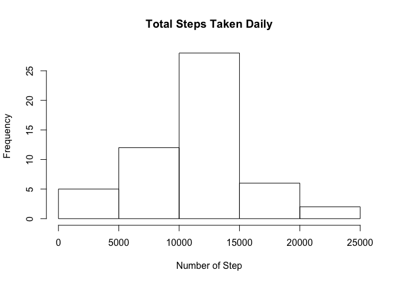
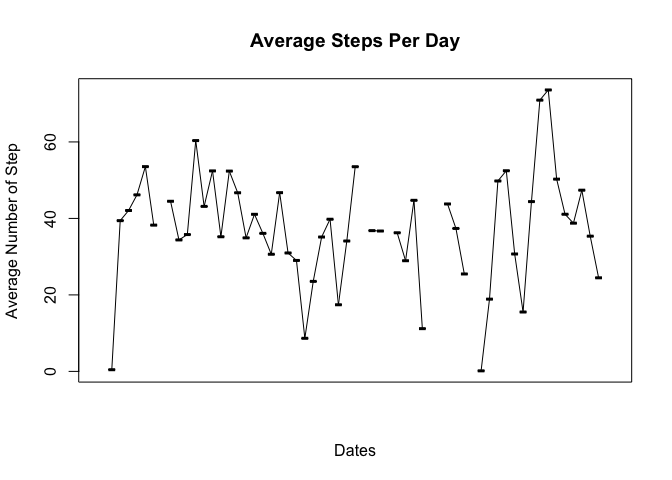
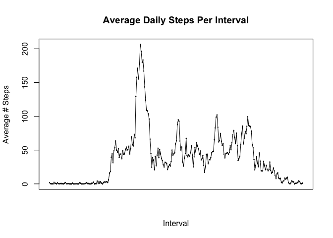
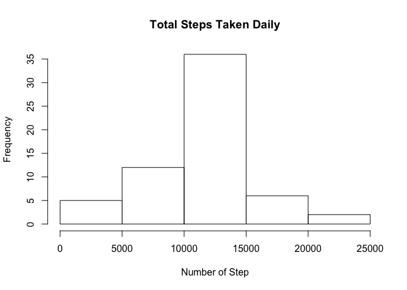
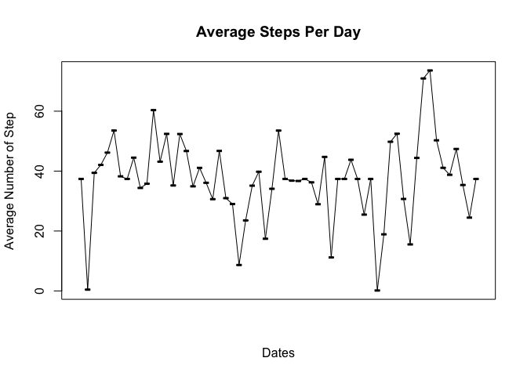
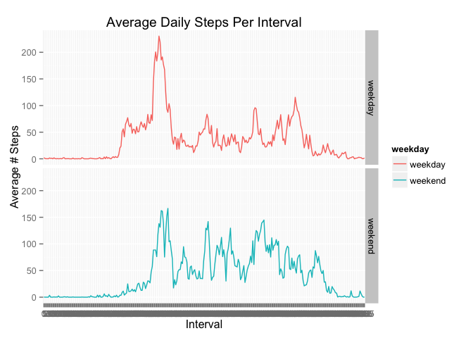

# Reproducible Research: Peer Assessment 1
Policarpio A. Soberanis  


## Loading and preprocessing the data
**setwd('Set your working directory')**

```r
library(dplyr)
```

```
## 
## Attaching package: 'dplyr'
## 
## The following objects are masked from 'package:stats':
## 
##     filter, lag
## 
## The following objects are masked from 'package:base':
## 
##     intersect, setdiff, setequal, union
```

```r
library(data.table)
```

```
## 
## Attaching package: 'data.table'
## 
## The following objects are masked from 'package:dplyr':
## 
##     between, last
```

```r
library(xtable)
unzip('activity.zip')
activity<-read.csv('activity.csv')
```

## What is mean total number of steps taken per day?

```r
daily<-group_by(activity,date)
daily_data<-data.table(summarize(daily,Total_Steps=sum(steps),Avg_Steps=mean(steps),Median_Steps=median(steps)))
hist(daily_data$Total_Steps,xlab='Number of Step',main='Total Steps Taken Daily')
```

 

```r
plot(daily_data$date,daily_data$Avg_Steps,xlab="Dates",ylab="Average Number of Step",main="Average Steps Per Day",xaxt="n")
lines(daily_data$date,daily_data$Avg_Steps)
```

 

```r
tmp<-summary(activity)
```
The mean number of steps taken per day is:
**Mean   : 37.38  **

The median number of steps taken per day is:
**Median :  0.00  **

## What is the average daily activity pattern?
To determine the average daily pattern we plot the average number of steps takean across all days
for each 5 sec interval.

```r
activity$interval<-as.factor(activity$interval)
spans=group_by(activity,interval)
mean_steps_per_day<-data.table(summarize(spans,avg_per_interval=mean(steps,na.rm=TRUE)))
plot(mean_steps_per_day$interval,mean_steps_per_day$avg_per_interval,xlab="Interval",ylab="Average # Steps",main="Average Daily Steps Per Interval",xaxt="n")
lines(mean_steps_per_day$interval,mean_steps_per_day$avg_per_interval)
```

 

```r
tmp1<-mean_steps_per_day[mean_steps_per_day$avg_per_interval==max(mean_steps_per_day$avg_per_interval)]
```

From the plot above labeled **Average Daily Steps Per Interval** we see that the interval with the maximum average number of steps
is 835.

## Imputing missing values

```r
tmp<-is.na(activity$steps)
total_NA<-sum(tmp)
```
Upon further analysis of the data the number of rows with missing vales is 2304. We will use the average number of steps over all days for the corresponding 5 minute inveral.

```r
indx<- activity$interval[tmp]
activity$steps[tmp]<-mean_steps_per_day$avg_per_interval[indx]
tmp<-summary(activity)
```

With the missing data being estimated by the average number of steps over all days for the corresponding 5 minute interval, we see that the histogram now peaks at 35 instead of 25. With the imputed values we now have a much higher daily total number of steps.

The mean number of steps taken per day with imputed values is:
**Mean   : 37.38  **

The median number of steps taken per day with imputed values is:
**Median :  0.00  **

Imputing the missing values has no effect on the mean and median of the overall data.


```r
daily1<-group_by(activity,date)
daily_data1<-data.table(summarize(daily1,Total_Steps=sum(steps),Avg_Steps=mean(steps),Median_Steps=median(steps)))
hist(daily_data1$Total_Steps,xlab='Number of Step',main='Total Steps Taken Daily')
```

 

```r
plot(daily_data1$date,daily_data1$Avg_Steps,xlab="Dates",ylab="Average Number of Step",main="Average Steps Per Day",xaxt="n")
lines(daily_data1$date,daily_data1$Avg_Steps)
```

 

## Are there differences in activity patterns between weekdays and weekends?

```r
library(lubridate)
```

```
## 
## Attaching package: 'lubridate'
## 
## The following objects are masked from 'package:data.table':
## 
##     hour, mday, month, quarter, wday, week, yday, year
```

```r
library(ggplot2)
weekdays1 <- c('Monday', 'Tuesday', 'Wednesday', 'Thursday', 'Friday')
activity$weekday<-factor(weekdays(parse_date_time(activity$date,"%y-%m-%d")) %in% weekdays1,levels=c(TRUE,FALSE),labels=c('weekday','weekend'))
spans1<-group_by(activity,interval,weekday)
mean_steps_per_day1<-data.table(summarize(spans1,avg_per_interval=mean(steps)))
p<-ggplot(mean_steps_per_day1,aes(x=interval,y=avg_per_interval,group=weekday,color=weekday))
p+geom_line()+facet_grid(weekday~.)+xlab("Interval")+ylab("Average # Steps")+ggtitle("Average Daily Steps Per Interval")
```

 

Based on the plots there is a clear pattern to when there is an uptick in number of steps. There is also pattern in when the number of steps decrese in both weekend and weekdays. For both groups of data the maximum average daily seems to occur at roughly the same timeframe.
